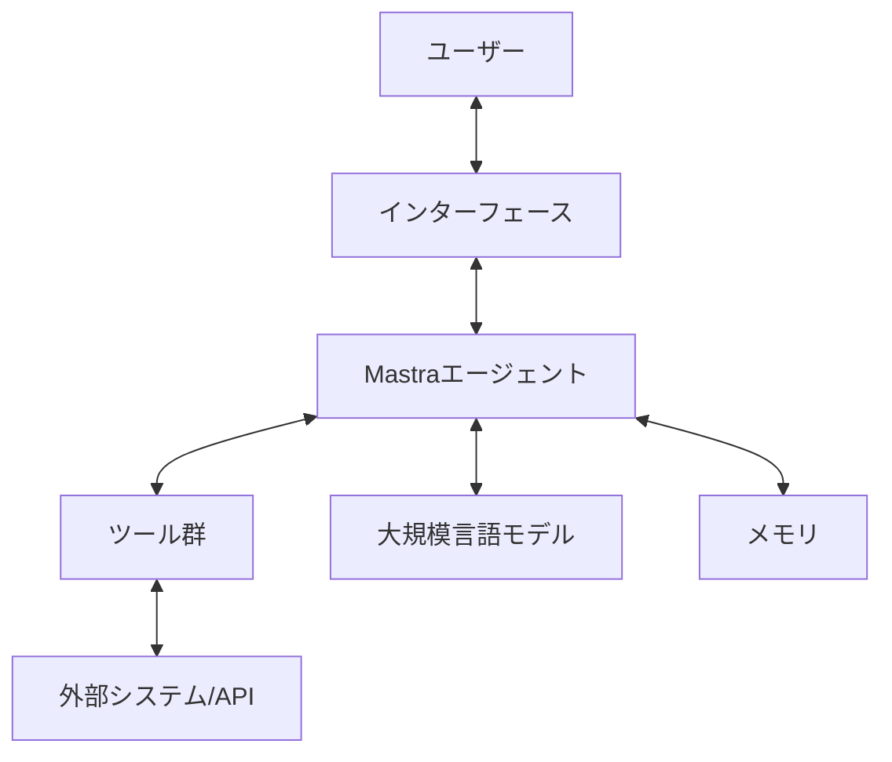

# システムパターン

## システムアーキテクチャ

本プロジェクトでは、Mastraを使用してAIエージェントを実装します。各エージェントは独立したモジュールとして設計され、以下の共通アーキテクチャに従います。

## 主要コンポーネント

### 1. インターフェース
- **ウェブインターフェース**: Streamlitを使用したウェブベースのインターフェース
- **コマンドラインインターフェース**: 一部のエージェントではCLIも提供

### 2. Mastraエージェント
- エージェントの中核となるコンポーネント
- ユーザー入力の処理、意図の理解、適切なツールの選択、応答の生成を担当

### 3. ツール群
- エージェントが使用する様々なツールのコレクション
- 各エージェントの目的に応じて異なるツールセットを実装
- 例: ウェブ検索、データ分析、ファイル操作、APIリクエストなど

### 4. 大規模言語モデル (LLM)
- OpenAI GPT-4、Claude、Llama 3などのLLMを使用
- エージェントの思考プロセスと応答生成を担当

### 5. メモリ
- 会話履歴や重要な情報を保存
- 長期的なコンテキスト維持のための仕組み

### 6. 外部システム/API
- 各エージェントが必要とする外部サービスやデータソース
- 例: 金融データAPI、法律データベース、健康情報サービスなど

## 設計パターン

### 1. エージェントパターン
- 各AIエージェントは自律的に動作し、特定のタスクを実行
- ユーザーの代理として意思決定と行動を行う

### 2. ツール使用パターン
- エージェントは目的に応じて適切なツールを選択・使用
- ツールは標準化されたインターフェースを持ち、交換可能

### 3. RAG (Retrieval-Augmented Generation) パターン
- 外部知識を取得し、LLMの生成能力と組み合わせる
- 正確性と最新性を向上させる

### 4. マルチエージェント協調パターン
- 複雑なタスクでは複数のエージェントが協力
- 専門化されたエージェントが特定の役割を担当

### 5. メモリ管理パターン
- 短期・長期メモリの効果的な管理
- コンテキスト窓の制限を克服するための戦略

## 技術的決定

### 1. Mastraフレームワークの採用
- 理由: 強力なエージェント開発機能と柔軟性を提供
- 代替案: LangChain、AutoGen、CrewAIなど

### 2. Streamlitの使用
- 理由: 迅速なプロトタイピングと直感的なUIを実現
- 代替案: Gradio、Flask、FastAPIなど

### 3. モジュラー設計
- 理由: 再利用性、保守性、拡張性を向上
- 各エージェントは共通のコアコンポーネントを共有しつつ、特化した機能を追加

### 4. 環境変数による設定管理
- 理由: セキュリティとポータビリティの向上
- APIキーなどの機密情報は.envファイルで管理

### 5. マークダウン形式のドキュメント
- 理由: 読みやすさと保守性の向上
- コードとドキュメントの一貫性を維持
